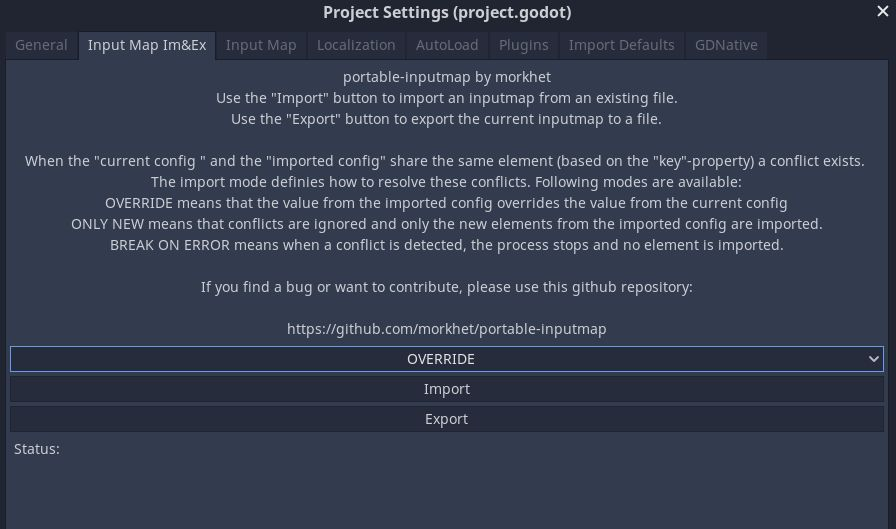

# portable-inputmap
godot plugin for easy import and export of the inputmap.

## Installation
Please use the official documentation for installation
https://docs.godotengine.org/en/stable/tutorials/plugins/editor/installing_plugins.html#installing-a-plugin

## Usage
After you have installed and enabled the plugin, you can use the available functions via the tab in the project settings window.

